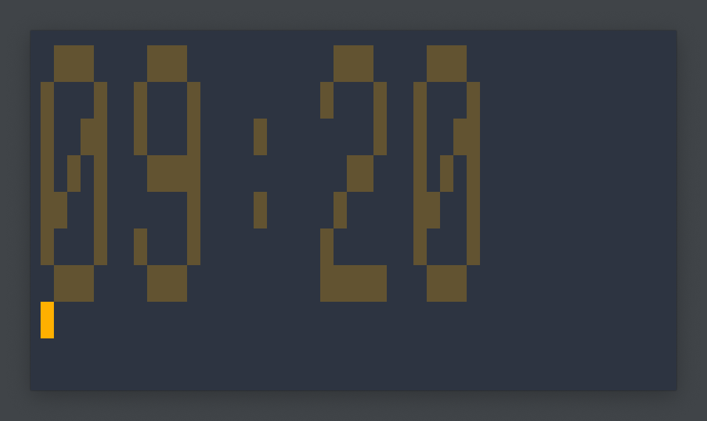

<h1 align=center>⌚It's a clock. In the Terminal.</h1>

<p align=center>
  <samp>That's all it is. It's a clock.</samp>
</p>

---

### Show the time

```
$ ./clock
```

### Make it "real"

```console
$ while true; do clear; ./clock ; sleep 5; done
```

### And it works



## Philosophy

1. **Small is Beautiful.**
   - Do one thing,
   - Do one thing well.
1. **Get the PoC out ASAP.**
   - Consider your code dead two weeks after inception.
1. **n'joy!**

<small>_sounds familiar?_ [It should!](https://en.wikipedia.org/wiki/Unix_philosophy#Origin)</small>
